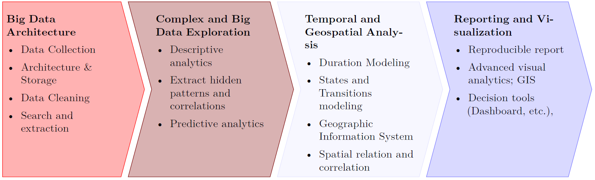

```{r setup, include=FALSE}
knitr::opts_chunk$set(echo = FALSE)
```

# Plan and Organisation of the lesson

## Today

1. Introduction (45min)
2. Reproducible research (45min)
   + *in-class*: introduction & demo
   + *out-of-class*: reading
3. Case Study (1h30min)
   + Team work on Data Visualizations
   + Discussion

# Introduction
## Context 

- Industry 4.0, Digital Factory, Internet of Things, Digital Economy

- Assessing the relevance of data and selecting the **right data for business decisions** is a key strategic capability.

- Analysis of complex and **big data**, **temporal**  and **spatial** data 

   + needs **specific skills** to search and to extract the relevant information 
   + to **analyze** them accordingly with their specific dimensions.
   
##  Some definitions

**Many notions**

For examples *"AT&T business" offers*

> Data science solutions for IoT including Artificial Intelligence and machine learning 

_ _ _


### Big Data

- most cited definition of big data includes the 3Vs (**Volume, Variety, and Velocity**) *Laney (2001)*
- big data should include ‘**Value**’ *(Gantz et al., 2011)*
- big data should also have ‘**Veracity**’ *(Zikopoulos et al., 2013)*

_ _ _

### Data Sciences

- Data Manager
- Data Miner
- Data Analyst
- Data Scientist

_ _ _ 

### Tools

Data Science, Machine Learning, Statistics, AI, etc

#### More than 30 models and families

\tiny

\begin{multicols}{2}
\begin{itemize}
    \setlength\itemsep{-0.5em}
    \item Generalized Additive Model
    \item Generalized Linear Model
    \item Generalized Non-Linear Model
    \item Multinomial Logistic Regression
    \item Multinomial Probit
    \item Linear Model
    \item Indicator (Identity) Linear Model
    \item Logistic Regression
    \item Probability (Unit) Regression
    \item Cumulative Logistic Regression
    \item Cumulative Probability (Unit) Regression
    \item Complementary Log-Log Model
    \item Continuation-Ratio Logistic Regression
    \item Hierarchical Logistic Regression
    \item Poisson Log-Log Regression
    \item Negative Binomial Regression
    \item Conditional Regression Model
    \item Mixed Logistic Regression
    \item Linear Discriminant Analysis
    \item Quadratic Discriminant Analysis
    \item Support Vector Machines
    \item Order Support Vector Machines
    \item Support Vector Ordinal Regression
    \item K Nearest Neighbours
    \item Classification And Regression Trees
    \item Separating Hyperplanes
    \item Neural Networks
    \item Feed-Forward Neural Networks
    \item Bayesian Neural Networks
    \item Markov Chains
    \item Markov Chains Monte Carlo
    \item Deep Neural Networks
\end{itemize}
\end{multicols}

\normalsize

_ _ _

## Several criterias differenciating the methods

\tiny

\begin{multicols}{2}
\begin{itemize}
    \setlength\itemsep{-0.5em}
    \item Supervised
    \item Unsupervised
    \item Additive
    \begin{itemize}
        \tiny
        \item Linear
        \item Non-linear
    \end{itemize}
    \item Generative
    \item Discriminative
    \item Parametric
    \item Semi-parametric
    \item Non-parametric
    \item Classification
    \item Regression
    \item Binary data
    \item Multinomial data
    \item Ordinal data
    \item Count data
    \item Continuous data
    \item Explicative
    \item Data driven
\end{itemize}
\end{multicols}

\normalsize


_ _ _

## @hastie2009sl *reference*

\centering\includegraphics[height = 70mm]{./data/Taxonomie/hastie2009st_cut.jpg}

_ _  _

## @mullainathan2017ml *reference*

\centering\includegraphics[height = 70mm]{./data/Taxonomie/mullainathan2017ml.png}

_ _  _


## @agresti2007cd *reference*

\centering\includegraphics[height = 70mm]{./data/Taxonomie/agresti2013cd.png}

_ _ _

### Artificial Intelligence (AI)


## Industrial issues


### **Smart Analytics in Industry 4.0**

@LEE20143 identify that

- self-learning machines are still far from implementation in current industries
- advances are expected in 5 distinct categories:

1. *Manager and Operator Interaction*: machine control and schedule design have to include machines health
1. *Machine fleet*: prognostic and health management methods have to consider the fleet of machines

_ _ _

1. *Product and Process Quality*: product quality informs on the process quality
1. *Big Data and Cloud*: Data management and distribution in Big Data environment
1. *Sensor and Controller Network*: decision-making algorithms depend on wrong and inaccurate readings

_ _ _

#### **Smart Machine Maintenance**

+ Machine health awareness analytics with self-learning knowledge base

+ Decision support analytics for self-maintenance


#### **Servitization** 

- to shift from selling products, to selling an integrated product and service offering that delivers value in use (@Martinezetal2010)

_ _ _

#### **Product-Service System (PSS)**

- system of products, services, supporting networks, and infrastructure
that is designed to be competitive, satisfy customers' needs,
and have a lower environmental impact than traditional
business models (@Mont2004)


- Market goal of manufacturers: 
  + is not one-time product selling, but
  + continuous profit from customers by total service solution, which can satisfy unmet customers’ needs.

_ _ _

### Industrial big data environment

Industry 4.0 with *Smart Machine Maintenance*, *servitization* and *PSS* imply:

- different units of observation, analyse and decision
  + from 'human-related data' to 'machine generated data' (machine, controllers, sensors, manufacturing systems, etc.)
  + sales prediction, user relationship mining and clustering, recommendation systems,
opinion mining, etc. 

_ _ _

- SI networks. From the sensor to the dashboard and decision
  + compatibility and standard issue
  + vibration, pressure, etc. are added to historical data
  + this aggregation is  called “Big Data”
- not a one shot process: dynamic workflow
  +  integrated platform, predictive analytics, and visualization
tools


## Conclusion

Challenges are to switch:

- from Data Analytics
- to DS projects, including 
  + BD dimension
  + DM
  + DA
  + OR

> **DS and OR : the new challenges**


# Class organisation
   
## Goals

> Be DM, DA and DS supervisor in the Big Data context


## Teachers and Industrial Contributors
### GI and Ensimag: 

  - *Christophe Bobineau*, MCF, Grenoble INP ENSIMAG
  - *Iragaël Joly* [^1], MCF HDR, Grenoble INP Génie industriel
  
[^1]: corresponding teacher: iragael.joly@grenoble-inp.fr

  - *Pierre Lemaire*, MCF, Grenoble INP Génie industriel
  - *Genoveva Vargas Solar*, DR, CNRS, LIG, HADAS Group 

### Invited Teachers: 
  - *Bruno Agard*, PR, Laboratoire en Intelligence des Données (LID), Département de Mathématiques et de Génie Industriel, École Polytechnique de Montréal   
  

## Organisation of the course

- Data supply-chain: from data collection and production, storage and organization, management, exploitation and analysis, and communication. 

- Big data and dynamic process of analysis needs transparent, repeatable and reproducible technics. 

- Backward presentation: from needs to solutions


## Three +1 parts

1.	**Big-Data Management**

2) **Exploration of complex data with high dimensionality** 

3)	**Analysis of complex data with temporal and / or spatial dimensions** 

4)	**Visualization  and communication**


## Planning

{width=90%}

## Tools

- RStudio = R + Rmarkdown
- Other tools for DM: MongoDB, ...

## Evaluation  
- Individual evaluation, e.g. in-class work (TP), multiple choice questions or closed-formed quizzes and **exam**
- Application Project realized in group: **Mobility project**

# Conclusion

## DS Workflow

From the class

{width=80%}

_ _ _

To 


{width=40%}


# References

  
