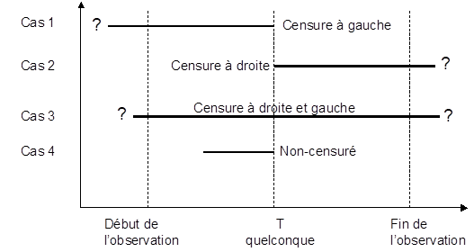
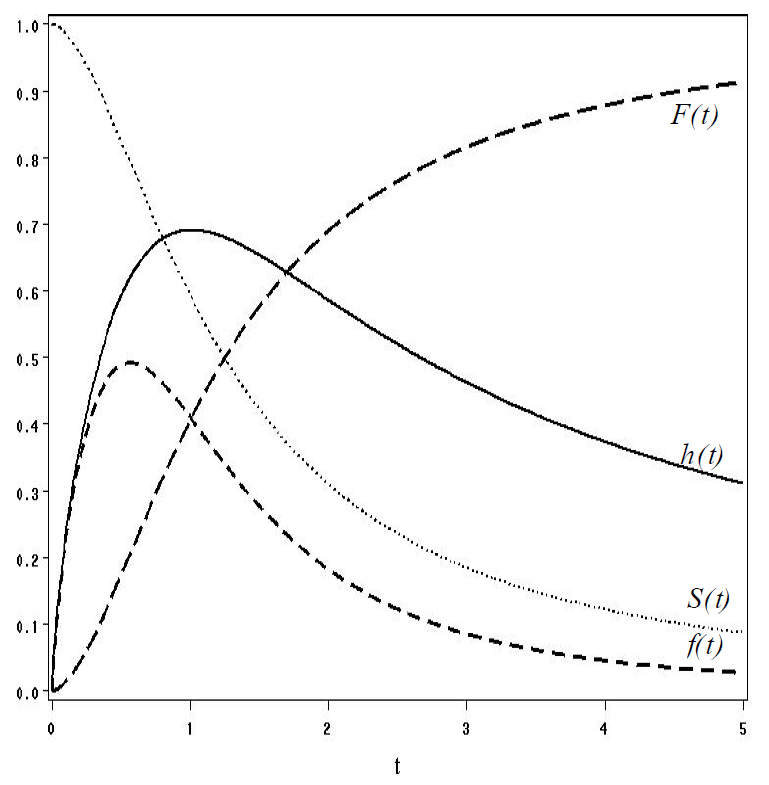
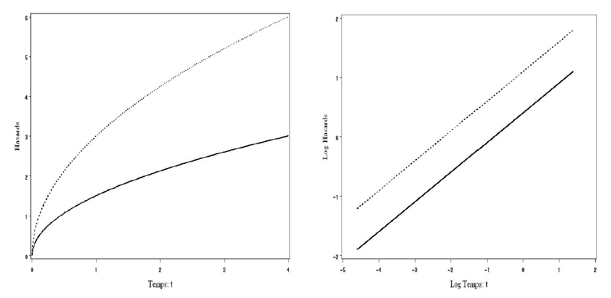
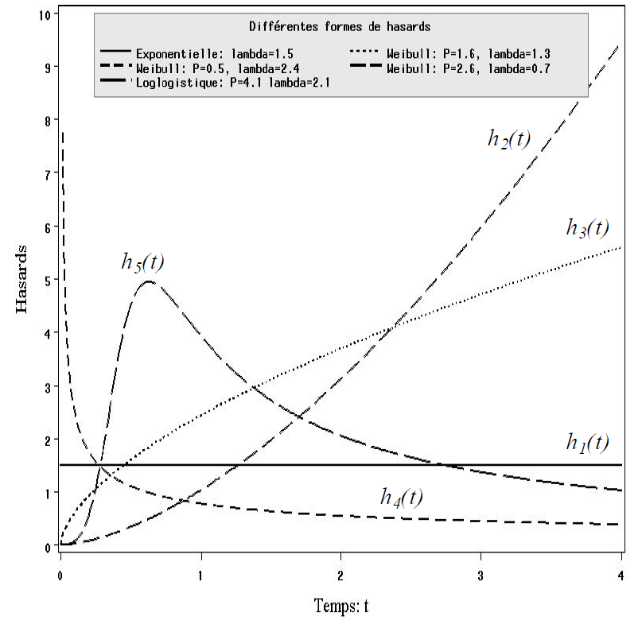

**A FINIR**

```{r include=FALSE}
library(dplyr)
library(survival)
library(survminer)

```

# Introduction


\alert{Survival analysis} corresponds to a set of statistical approaches used to investigate the \alert{time it takes for an event} of interest to occur.

- Medecine, sociology, economy
- informatics, engineering,...


In *basic categorical data* analysis for example, we compare proportions (risks, rates, etc) between different groups.

Such analysis is performed using a chi-square or fisher exact test, or logistic regression.

We implicitly assume that the *rates are constant over the period of the study*, and are defined by the different groups studied.

But **longitudinal studies** aim at tracking / observing samples or subjects from one time point (e.g., entry into a study, diagnosis, start of a treatment) until occurence of some outcome event (e.g., death, onset of disease, relapse)

It doesn’t make sense to assume the rates are constant over time. 

For example: 
- the "risk" to find a job is increasing in the first months of search, reaches a top and then decreases
- the risk of death after heart surgery is highest immediately post-op, decreases as the patient recovers, then rises slowly again as the patient ages.


**Survival analysis** is used to model time-to-event (time until an event occurs) or compare the time-to-event between different groups, or how time-to-event correlates with covariables


## Overview

Most of survival analyses use the following methods:

- Kaplan-Meier plots to visualize survival curves
- Log-rank test to compare the survival curves of two or more groups
- Cox proportional hazards regression to describe the effect of variables on survival. The Cox model is discussed in the next chapter: Cox proportional hazards model.


## Basic concepts

Survival analysis focuses on the **expected duration** of time until occurrence of an event of interest (relapse or death). 

However, during the period of observation, the event may not be observed for some individuals, producing **censored observations**.

Censoring is a type of missing data, unique to the survival analysis. 
*Right censoring* happens when you track the subject through the end of the study and the event never occurs. This could also happen due to the subject dropping out of the study (for other reasons than the event under study)

*Left censoring* occurs when the “start” is unknown.

We only know that the data is at least $t$, we do not know anything about survival time after that.



The **survival** function, is the probability an event does not occur (an individual survives) up to and including time $t$.

$$S(t)=Pr(T>t)$$
where $T$ is the time-to-event.
 
$S$ is a probability, so $0\leq S(t) \leq 1$, since survival times are always positive ($T \geq 0$)


```{r echo=FALSE}
lung <- as_tibble(lung)
sfit <- survfit(Surv(time, status)~sex, data=lung)
plot(sfit)
ggsurvplot(sfit)
```


The **hazard** is the instantaneous event rate at a particular time point $t$.

Survival analysis doesn’t assume the hazard is constant over time.

$$h(t) = lim_{\Delta \rightarrow 0} \frac{P( t \leq T < t+ \Delta \quad | \quad  T \geq t)}{\Delta}$$

Survival function can be writen:

$$S(t)= P(T \geq t)= 1 -F(t)$$, with $F(t)$ a cumulative distribution function, associatd to the density function $f(t)$:
$$ f(t)= lim_{\Delta \rightarrow 0}\frac{P( t \leq T < t+ \Delta)}{\Delta}$$

Hence, hasard rate is:

$$h(t)= lim_{\Delta \rightarrow 0} \frac{F(t+\Delta) - F(t)}{\Delta (1- F(t) )}$$
$$h(t) = \frac{f(t)}{1-F(t)}=\frac{f(t)}{S(t)}= \frac{ \partial F(t) / \partial t}{S(t)}=\frac{-\partial S(t) / \partial t}{S(t)}=\frac{-\partial lnS(t)}{\partial t}$$

The cumulative hazard is the total hazard experienced up to time $t$.

$$H(t)=\int_0^t h(t) dt = - ln S(t)$$

- Hasard function gives the risk of interruption of the duration process (the risk of occurence), knowing that the the process has lasts until $t$
- Only 'survivors' are observed until $t$
- Hasard may be different at each time
- Hasard gives the temporal dynamics of the process

Survival function:
-	$S(t)$ is the probability an individual atteign the date $t$
-	Median survival, at each data $t$, gives an estimate of the expected survival time, at each time
- Shape of $S(t)$ illustrates the temporal dynamic of the process.





## Estimation 

Estimation techniques can be viewed as *non-parametric*, *semi-parametric* or *parametric*.

- *Non-parametric* methods are mainly used to describe the hasard and survival functions. Can be usefull for bivariate analysis (test survival difference between groups)
- *Parametric* methods consist in the fit of a multivariate functionnal form, taking into account effects of covariates (as in linear regression)
- *semi-parametric* methods are non parametric form for the time distribution but introduce parametric form for the covariates effects: *Proportional hazards*


Parametric and semi-parametric models are linked.

We decompose the hazard and survival functions to identify the effect of covariates on the hazard and the temporal dynamics (effect of elapsed time on the probability of occurence):

- Baseline function ($h_0(t)$ and $S_0(t)$) is linked to the assumed distribution function describing the time effect - the hazard / survival at time $t$ for an individual where all covariables are 0
- Covariates functional form: $g(\beta'X)$, which affects either 
  + the baseline function ($h_0(t)$): **Proportional hazards models**
  + or directly the time $t$: **Accelerated failure time models**

Parametric estimation techniques permit

–	several possible distributions to describe the temporal dynamics (constant, monotonic and non-monotonic hazards are allowed)
–	estimation of the covariates effects
–	estimation of the parameter of the temporal distribution
- gives precise estimations of both temporal dynamics and covariates effects (with all inference properties: CI, PV, etc)

Semi-parametric approaches constrain the model to proportional hazard (separating temporal dynamics and covariates effects). 

- covariates effects are precisely estimated, under proportionality assumption (which should be tested)
- temporal dynamics is unconstrained (no parametric distribution is assumed)

Preference between semi-parametric and parametric models is debate subject in litterature as each method has its pro and cons - strenghts and weakness.


## Non-parametric estimation

### Kaplan-Meier estimator

Survival function is estimated using the KM limit product (@kaplan58). Estimated survival à time $t$ is calculated as the product of the following proportions:
$$S_{KM}(t_j) = \prod^j_{k=1}  \frac{ n(t_k) - d(t_k)}{ n(t_k)}$$
where $n(t_k)$ is the population at risk at time $t_k$.

$d(t_k)$ is the number of events at time $t_k$.

or $$S_{KM}(t_k) = S_{KM}(t_{k-1}) \cdot \left( 1- \frac{ d(t_k) }{ n(t_k)} \right)$$

This survival function is a step function at each discret time associated to an event.

$S_{KM}$ approches the probability at each step, each time of occurence and multiply them to estimate the survival function.

The $S_{KM}$ curve is a step function illustrating the cumulative survival probability over time. 

The curve is horizontal over periods where no event occurs, then drops vertically corresponding to a change in the survival function at each time an event occurs.

Censored observation are taken into account until they are out of the sample, but they do not count as event.

It has been shown that $S_{KM}$ is asymptotically distributed like a normal law (@Andersen1993, @Fleming1991). 

Hence, asymptotic confidence interval is given by 

$$\hat{S}(t) \pm z_{1-\alpha/2} \hat{\sigma}_{\hat{S}(t)}$$
where $z_{1-\alpha/2}$ is the normal standard quantile and $\hat{\sigma}_{\hat{S}(t)}$ is the standard error obtained from the variance of the survival estimator (@Greenwood1926):
$$\hat{V} (\hat{S}(t)) = ( \hat{S}(t)  )^2 \sum_{i: t_i \leq t} \frac{ d_i}{n_i(n_i - d_i)}$$

### Testing survival equivalence between classes

Survival equivalence are based on contingency table at each tdate $t_i$


Differences are tested between events occurence in a class $j$: $d_j(t_i)$ and the number of predicted events: $\hat{e}_j(t_i)$ based on the estimation of a common survival function to each class

Contingency table is of the form:


| Event |  Class 1 |  Class 0 | Total |
|:-----------:|:------:|:------:|:------:|
| Interruption | $d_1(t_i)$ | $d_0(t_i)$ | $d(t_i)$ |
| Non interruption | $n_1(t_i)-d_1(t_i)$ | $n_0(t_i)-d_0(t_i)$ | $n(t_i)-d(t_i)$ |
| Population at risk | $n_1(t_i)$ | $n_0(t_i)$ | $n(t_i)$ |

$d_1(t_j)$ is the number of event at time $j$ in group 1.
$d(t_j)$ is the total number of event in both groups at time $j$

$n_1(t_j)$ is the number at risk just prior to time $j$
$n(t_j)$ is the total number of cases that are at risk just prior to $j$.

Estimation of the predicted number of events in class 1 at each date $t_j$ is:

$$ \hat{e}_{1j} = \hat{e}_1(t_j) = \frac{n_1(t_j) d(t_j)}{n(t_j)}= \frac{n_{1j}d_{1j}}{n_{j}}$$

#### The log-rank test

For group 1 the log-rank statistic can be written as: $\sum_{j=1}^r (d_{1j} - e_{1j})$, where the summation is over all unique event time (from $1$ to $r$). $d_{1j}$ is the number of event occuring at time $j$ in group 1. and $e_{1j}$ is the expected number of events in group 1 at time $j$.

#### The Wilcoxon test

It differs from the log-rank only by the presence of $n_j$, the total number at risk at each time. Thus, it is a weighted sum of the deviations (from observed to expected number of events)

Wilcoxon gives more weight to early times than late times (as $n_j$ decreases), it is less sensitive than the log-rank test to differences between group that occur at later point in time.

Log-rank test is more powerful for detecting differences of the form : $S_1(t)= [ S_2(t) ]^\gamma$, where $\gamma$ is a positive number other than 1.
This equation gives proportional hazard model.

Wilcoxon is more powerfull in situation where event times have log-normal distribution with commun variance


## Proportional Hazards - semi-parametric estimation


\alert{Proportional hazards} assumption: 

- compare the hazard at different times over the observation period. 
- Proportional hazards analysis doesn’t assume that the hazard is constant - 
- but does assume that the **ratio of hazards** between groups is **constant** over time. 
- cumulative hazard ratio between two groups remains constant over time.


Proportional hazards regression a.k.a. Cox regression is the most common approach to assess the effect of different variables on survival

###  PH model & Cox model

Non-parametric methods are good for visualizing and testing differences in survival between two categorical groups

Studying the effect of quantitative variables in a multivariate way needs to model link between covariates (both categorical and continuous variables) and hazard.

Under proportional hazards assumption:

$$ h(t | X)= h_0(t) g(X, \beta)$$
Where $g(X,\beta)= exp\{(X \beta \}$ (@Cox1972)

Hence: $ h(t | X)= h_0(t) exp \{X \beta \}$

Positive coefficient associated with $X$ implies a positive impact of the covariate on the hazard, and as consequence a decrease in survival time.

Finally, the Cox model estimates:

$$ln h(t) = ln h_0(t) + X \beta $$
where $h_0(t)$ is the baseline hazard function depending on $t$. Effects of covariates $X$ is assumed to impact in a multiplicative way the hazard. Hence, the baseline hazard $h_0(t)$ is 'shared' by all individuals as a baseline hazard.

$h_0(t)$ and  $g(X,\beta)$ are such that $h(t)$ is positive. And  $h(t)=h_0(t)$ when $g(X,\beta)=1$ and $g(X=0,\beta)=1$.

$h_0(t)$ depends only on the survival time and represents the varying conditional probability of event with time independtly from the covariates.

Such decomposition of the hazard function is supported by fully parametric models for which the chosen distribution is compatible with the HP assumption (exponetial and Weibull distributions)


Ratio of the hazards of individuals $i$ and $j$ (differing in terms of covariates $X$: $X_i$ and $X_j$) is:
$$ \frac{h_i(t)}{h_j(t)}= \frac{h_0(t) \times g(X_i, \beta)}{h_0(t) \times g(X_j, \beta)}= \frac{h_0(t) exp\{ X_i \beta \} }{ h_0(t) exp\{ X_j \beta \} }=
exp\{  (X_i - X_j) \beta \}$$

**Interpretation:**

Coefficient are interpretable as effects on the hazards ratio or in terms of change of the log hazard with respect to the covariate (as relative variation of the hazard): 
$$ \frac{ \partial h(t)}{\partial X_k} = \frac{\partial \ln \left[ h_0(t) \cdot g(X, \beta) \right] }{\partial X_k} = \frac{\partial \ln g(X,\beta)}{\partial X_k}=\frac{\ln (exp\{ X \beta  \} ) }{\partial X_k}= \beta_k$$


Note that a positive $\beta > 0$ will leads to an decrease in time-to-event, as it increases the hazard

-	for binaries variables: $e^\beta$ gives the ratio of hazards
-	for quantitative variables: +1 unit of $X$ leads to a change in the hazard of $100 \times (e^{\beta}-1)$ %. 

Elasticity of the hazard rate with respect to the variable $X_k$ is:

$$\epsilon_k = \frac{X_k}{h} \times \frac{\partial h}{\partial X_k}= \frac{\partial ln h}{\partial ln X_k}= \beta_k X_k
$$




**Cox PH regression**

Cox PH regression models the natural log of the hazard at time $t$, denoted $h(t)$
, as a function of the baseline hazard $(h_0(t))$ and multiple covariates ($x_1, \dots x_k$). 

The form of the Cox PH model is:

$$\ln (h(t)) = \ln (h_0(t) )+ \beta_1 x_1 + \beta_2 x_2 + \dots + \beta_k x_k$$

Assume a restricted model to a unique binary covariate (exposure: $x_1=1$ and non exposure $x_1=0$), we have (after exponentiation):
$$h_1(t)=h_0(t) \cdot  e^{\beta_1 x_1}$$
The hazard ratio comes:
$$HR(t) = \frac{h_1(t)}{h_0(t)}=e^{\beta_1}$$
Which shows the constant hazard over all $t$

### Estimation of the Cox model

The Cox model estimation does not need specification of the duration distribution (the baseline function).
This method offers opportunity to focus on covariates effect estimation.
As a counterpart, this method does not model the effect of covariates on the temporal dynamic, the $T$ distribution.

Usual likelihood function is written as the product of the likelihhods for all individuals in the sample. 

The partial likelihood is written as a product of the likelihoos for all events taht are observed.

$$PL = \prod_{j=1}^J L_j$$

where $L_j$ is the likelihood for the event $j$

$L_1$ is the partial likelihood for the first event: individual 1. Let suppose it occurs at time $t_1$.
$L_2$ is the partial likelihood for the second event: individual 2. At time $t_2$
etc.
To construct partial likelihood we ask: given that an event occured at a time $t_1$, what is probability that it happened to individual 1 rather than to one of the other individuals?

$$L_1 = \frac{ h_1(t_1)}{ h_1(t_1) + h_2(t_1) + \cdots + h_n(t_1)}$$
For the second event / individual:


$$L_2 = \frac{ h_2(t_2)}{  h_2(t_2) + \cdots + h_N(t_2)}$$
Note that individual 1 is no longer at risk, so $h_1(t_2)$ is removed.

Wih the HP parametrization:

$$L_1 = \frac{h_0(t_1) \cdot e^{\beta x_1}}{ h_0(t_1) \cdot e^{\beta x_1} +
h_0(t_1) \cdot e^{\beta x_2} + \cdots + h_0(t_1) \cdot e^{\beta x_N}}$$

Finally

$$L_1 = \frac{ e^{\beta x_1}}{ e^{\beta x_1} + e^{\beta x_2} + \cdots +  e^{\beta x_N}}$$


General expression of the partial likelihood from a PH model is:

$$PL = \prod^n_{i=1} \left[ \frac{e^\beta x_i}{\sum^n_{j=1} Y_{ij} e^{\beta x_j} } \right]^{\gamma_i}$$

where $Y_{ij} = 1$ if $t_j \geq t_i$ and $Y_{ij}=0$ if $t_j < t_i$

Taking the log likelihood permits estimation of the $\beta$s:


$$\ln PL = \sum_{i=1}^n \delta_i \left[  \beta x_i - \ln \sum_{j=1}^n Y_{ij} e^{\beta x_j} \right]$$

Use of the PL proposed by @Cox1972 avoids risk of mispecification of the distribution of $T$. In this case, estimates associated with covariates are considered as more reliable than in the fully parametric model with uncorrect assumed distribution (@Oakes1977). 

Drawback of this method is theoritically, an increase in the etimates variances, compared to the one obtained in the fully parametric wit correct distribution.
Nevertheless, several studies have shown that this loss in precision is low (@HensherMannering1994). 

@Efron1977 and  @Oakes1977 obtained variance-covariances matrix from Cox model estimates closed to those obtain in corresponding fully parametric model.


## Accelerated Failure Time model

Parametric models assume a log-linear form: $lnt= g(X,\beta) + \sigma \epsilon$
Where 

- $X$ is the matrix of covariates ($k$ columns $X_k$) 
- $\beta$ the associated vector of coefficients
- $\epsilon$ is the error term and $\sigma$ a scale coefficient

They assume the distribution of $\epsilon$ as known (normal, logistic or extrem value). The distribution of time-to-event $T$ will depend on the chosen $\epsilon$ distribution.

Given the field of application, function $g(X,\beta)$ may be different. 
In physics, following form can be found:
$g(X, \mu, \beta) = \mu +(lnX)\beta$, when $X$ is voltage ; $g(X, \mu, \beta) = \mu + (1/X) \beta$ when $X$ is  temperature

Commun specification, we will use here, is:

$$g(X, \mu, \beta) = \mu + \beta X$$

This form eases interpretation of the estimates

- when $X=0$ then $\mu$ represents the location parameter of the random variable $ln T$ ($E(g(X, \mu, \beta)= \mu + E(X\beta)$)
- the $\beta$ coefficients give the variation of $E(ln T | X)$.

The additive linear form ($X \beta$) permits a maximum likelihood estimation of the model.

Logarithme transformation ensures positive predicted values.

Time-to-event $T$ is deduced from $\epsilon$. 

$$t=exp \{g(X, \mu, \beta) \times (exp\{ \epsilon \})^{\sigma}  \}$$

This form is quiet flexible to model interaction between time and covariates.

Following, (@cox1988analysis) with $\lambda = exp\{ -g(X,\mu, \beta) \} = exp\{-X \beta\}$ , $\lambda$ has a scale factor role. If $\lambda >1$ the temporal scale is accelerated, and decreased when $\lambda < 1$

In the fully parametric model, covariates are assumed to interact with time :

$$S(t)= S_0( t \times exp\{ - \beta ' X \})$$

with $S_0(t)$ the baseline survival function.

Corresponding hazard function:

$$ h(t)= \frac{ -\partial S(t / X) / \partial t}{S(t / X)} = h_0( t \times exp \{ -\beta' X  \} ) \times exp \{ -\beta' X  \} ) $$
 
AFT model can be written as a log-linear model: $lnt = \beta'X + \epsilon$, where $\epsilon$ follows a density function $f(\epsilon)$.
Choosing different $f(\epsilon)$ leads to different models and baseline survival functions.

Interpretation of coefficients can be interpreted in terms of effect on $T$:
$\beta = \frac{ \partial ln T}{\partial X_k}$


For binary variables $X_k$: $e^{\beta_k}$ is the ratio of *survival times*.
For quantitative variables $100 \times (e^{\beta_k}-1)$% is the variation of the survival time associated with a change in covariate $X_k$.

### Usual distributions

**Distributions des résidus et distributions des durées**

| Residuals Distribution ($\epsilon$) | Duration Distribution ($T$) | Model Type |
|------------------|----------------------|--------------------|
| 1 parameter Extrem values | Exponential | PH and AFT | 
| 2 parameters Extrem values | Weibull | PH and AFT| 
| Logistic | Log-logistic | AFT| 
| Normal | Log-normal | AFT| 
| 3 parameters Log Gamma | Generalised Gamma | AFT| 


Exponential hazard ($h_1(t)$) is constant over time and caracterises process that are independant with time. Weibull hazard ($h_2(t), h_3(t), h_4(t)$), is monotonic. If it is positive, then the longer the time-to-event, the higher the probability of event.

Log-logistic hazard ($h_5(t)$) admits monotonic and non-monotonic forms, given the variance parameter of the distribution. 



For the mathematics of each of these three models see [./data/Pages_de_Annexe_theorique_MD.pdf](Pages_de_Annexe_theorique_MD.pdf)

### Graphical Diagnostic of the hazard form

Integrated hazard is usefull to evaluate graphically adequation of a model type to the data.

KM estimates will help distribution choice.

Note $g(X, \beta)=X\beta$ and $\lambda = exp \{ -g(X, \beta) \} = exp\{-X\beta\}$, and $\rho = 1/\sigma$ 

Integrated hazard are :

- **Exponential** case: $H(t)= \lambda \cdot t$
- **Weibull** case: $H(t) = (\lambda t) ^{\rho}$. Henc, its log is: $\ln H(t) = \rho \ln t - \rho X \beta$
- **Log-logistic** case: $H(t)=\ln \left(  1+ (\lambda t)^{\rho}\right)$. Hence: $\ln\left( exp \{  H(t) \} - 1 \right) = \rho \ln(\lambda t) = \rho \ln t - \rho X \beta$

We can deduce that each couple ($t,H(t)$) or their preceding transformations should follow a linear form with a specific slope.


#### Likelihood ratio test of the models


Choice of the parametric model can be supported with LR test. The LR test permits to test restriction of a general model versus its constrained version. Hence only nested models can be tested usong the LR test.

Only the log-logistic model is excluded. All aother models are nested (exponential, Weibull, log-normal and gamma)

The LR test statistics is:

$$ LR = 2 \cdot \left[ \ln L(\hat{\theta_{H1}} ) - \ln L(\hat{\theta_{H0}} ) \right]$$

where $\hat{\theta_{H1}}$ and $\hat{\theta_{H0}}$ are the parameters values taht maximise the likelihood function associated to the tested assumption $H_0$ and $H_1$.

Under $H_0$, LR statistics follow a $\chi^2$ distribution, with degres of freedom equal to the number of independant restrictions in $H_0$

Following restrictions are applicable to pass from the generalised gamma model to another model.

**Restriction of the generalised gamma parameter and corresponding model**

| Constraint | Model | $\chi^2$ distribution df |
|-----------|----------------|--------------------|
| $\sigma=1$ |  Gamma standard | 1 |
| $\delta=1$ and $\sigma \neq 1$ | Weibull | 1| 
| $\delta=1$ and $\sigma = 1$| Exponential | 2| 
| $\delta \rightarrow 0$ | Log-normal | 1| 

Generalised gamma density is characterised by two parameters, $\sigma$ and $\delta$:

$$f(t) = \frac{ \rho \lambda^{\frac{1}{\delta^2} } t^{ \rho \frac{1}{\delta^2} -1 } exp\{ -(\lambda t)^{\rho} \}  }{ \Gamma(\frac{1}{\delta^2}) }$$
## References 

https://rviews.rstudio.com/2017/09/25/survival-analysis-with-r/


https://bioconnector.github.io/workshops/r-survival.html

https://stats.idre.ucla.edu/r/examples/asa/r-applied-survival-analysis-ch-2/

https://stats.idre.ucla.edu/r/

http://www.sthda.com/english/wiki/survival-analysis-basics


- Textbook Examples Applied Survival Analysis: Regression Modeling of Time to Event Data, Second Edition by David W. Hosmer, Jr., Stanley Lemeshow and Susanne May :
(https://stats.idre.ucla.edu/other/examples/asa2/)